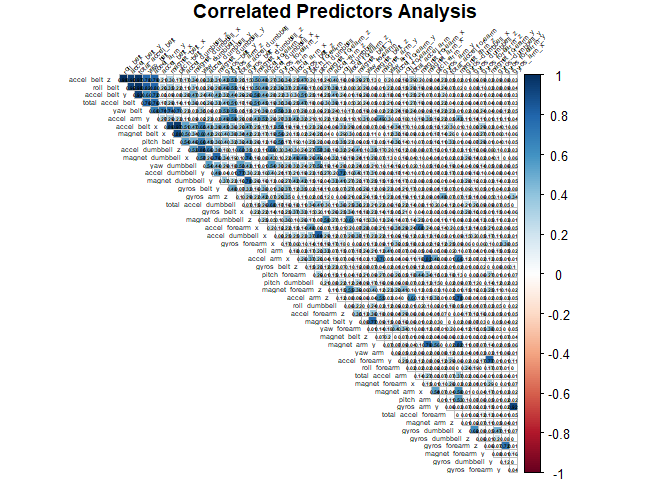

[Github link](https://github.com/darwinnava/Machine_Learning_Project)


## Data processing


This project involves exploring the dataset that come from the project "Wearable Computing: Accelerometers' Data Classification of Body Postures and Movements" by Ugulino, W.; Cardador, D.; Vega, K.; Velloso, E.; Milidiu, R.; Fuks, H..
[Human Activity Recognition](http://web.archive.org/web/20161224072740/http:/groupware.les.inf.puc-rio.br/har)

The training and testing data for this project are available here:  
[The training data](https://d396qusza40orc.cloudfront.net/predmachlearn/pml-training.csv)  
[The testing data](https://d396qusza40orc.cloudfront.net/predmachlearn/pml-testing.csv)  

It should be predicted the manner in which the 6 participants who performed dumbbell unilateral biceps curls did the exercise. This is the "classe" variable in the training set. They were asked to perform barbell lifts correctly and incorrectly in 5 different ways.  

### An exploratory statistical analysis. Summary of the data.  
**Loading the training and test sets and displaying the internal structure.**  
This will allow establishing a strategy for answering the study question:  The Weight Lifting -  Are you doing your unilateral dumbbell biceps curl wrong?  


```
## [1] "pml_training dimension: 19622 X 160"
```

```
## [1] "pml_testing dimension: 20 X 160"
```

```
## [1] "The code is available in the appendix."
```
**Data cleansing**  
**Handling Missing Values, na.strings=c("NA","#DIV/0!", ""):**  
The total number of rows is 19622 in pml_training. The total sum of NAs in each of the eliminated columns is greater than 19200, representing at least 97.84% of missing values in each of them. The total number of rows is 20 in pml_testing. The total sum of NAs in each of the eliminated columns is 20, representing 100% of missing values in each of them.This allows removing 100 columns from our datasets.  

```
## [1] "pml_training dimension: 19622 X 60"
```

```
## [1] "pml_testing dimension: 20 X 60"
```

```
## [1] "The code is available in the appendix."
```
**Handling Near Zero Variance,  participant idetification and  timestamps variables:**  
In pml_training all zeroVar results were FALSE except for the variable new_window. This variable will be removed. The variables raw_timestamp_part_1, raw_timestamp_part_2, cvtd_timestamp, num_window will be removed because they are used in a more specific type of prediction problem where data are dependent over time. The variables X and user_name will be removed too, in our case we seek to predict whether the weightlifting has been done correctly or not. This allows removing 7 columns from our datasets.  

```
##            freqRatio percentUnique zeroVar  nzv
## new_window  47.33005    0.01019264   FALSE TRUE
```

```
## [1] "pml_training dimension: 19622 X 53"
```

```
## [1] "pml_testing dimension: 20 X 53"
```

```
## [1] "The code is available in the appendix."
```
### An inference and prediction analysis 
**1. Find the right data and define your error rate**  
After the data cleansing, pml_training and pml_testing are going to be used.  

**2. Split data into: training,testing and Validation (Optional)**  
pml_training is a medium sample size. Validation is not going to be used.  

```
## [1] "training dimension: 14718 X 53"
```

```
## [1] "testing dimension: 4904 X 53"
```

```
## [1] "The code is available in the appendix."
```
**3. On the training set pick features, pick prediction functions and cross-validate.**  
Quantitatives variables highly correlated (>0.8) with each other are not useful to include them all in our model.  Processing covariants witn PCA-SVD can help to reduce predictors. Cross validation must be used in the model construction .The expected out-of-sample error should be reported.  
Then "Random forest, rf" is chosen. It has top performance along with boosting. Preprocessing with PCA and 5-fold Cross validation are going to be applied. The code is available in the appendix.  
<!-- -->

**Preprocessing with PCA**  
pcaComp = 12 and thresh=0.8 was set.  

```
##        PC1      PC2       PC3       PC4       PC5       PC6      PC7       PC8
## 1 3.908226 2.485103 -2.739082 0.5686560 -2.460519 0.6122135 2.450163 -1.103544
## 2 3.946956 2.501160 -2.741998 0.6292778 -2.543950 0.6474817 2.407966 -1.070013
## 3 3.912076 2.514701 -2.738037 0.5706382 -2.466756 0.6386818 2.433794 -1.081120
## 4 3.930074 2.509716 -2.730299 0.5883228 -2.500087 0.6474432 2.402445 -1.080673
## 5 3.904317 2.561618 -2.696388 0.5929345 -2.552038 0.6551338 2.390499 -1.101068
## 6 3.918251 2.534554 -2.738182 0.5795424 -2.496239 0.6401327 2.421848 -1.106315
##           PC9       PC10      PC11      PC12 classe
## 1 -0.15647675 -0.6472241 0.6042003 0.6197099      A
## 2 -0.11607012 -0.6473442 0.6020882 0.5535222      A
## 3 -0.11954061 -0.6489572 0.6028504 0.5758637      A
## 4 -0.08806033 -0.6265173 0.6210311 0.5696468      A
## 5 -0.14077346 -0.6499853 0.5920365 0.5005044      A
## 6 -0.12043119 -0.6580056 0.5869252 0.5988386      A
```

```
## [1] "The code is available in the appendix."
```


**The Random Forest Model**  
Preprocessing with PCA was doing previously. 5-fold Cross validation was set.  

```
## Random Forest 
## 
## 14718 samples
##    12 predictor
##     5 classes: 'A', 'B', 'C', 'D', 'E' 
## 
## No pre-processing
## Resampling: Cross-Validated (5 fold) 
## Summary of sample sizes: 11773, 11775, 11774, 11776, 11774 
## Resampling results across tuning parameters:
## 
##   mtry  Accuracy   Kappa    
##    2    0.9551575  0.9432688
##    7    0.9482269  0.9345018
##   12    0.9415690  0.9260773
## 
## Accuracy was used to select the optimal model using the largest value.
## The final value used for the model was mtry = 2.
```

```
## [1] "The code is available in the appendix."
```
**4. If no validation – apply 1x to test set**  
Remember that the pm_training set was partitioned. 75% to train the "rf" model (training) and 25% to evaluate it (testing). pml_testing has not been touched up to this point.  

```
## Confusion Matrix and Statistics
## 
##           Reference
## Prediction    A    B    C    D    E
##          A 1360   11   16    7    1
##          B   13  907   26    0    3
##          C   12    9  821    8    5
##          D   11    4   51  734    4
##          E    4    5    8    7  877
## 
## Overall Statistics
##                                           
##                Accuracy : 0.9582          
##                  95% CI : (0.9522, 0.9636)
##     No Information Rate : 0.2855          
##     P-Value [Acc > NIR] : < 2.2e-16       
##                                           
##                   Kappa : 0.9471          
##                                           
##  Mcnemar's Test P-Value : 4.016e-07       
## 
## Statistics by Class:
## 
##                      Class: A Class: B Class: C Class: D Class: E
## Sensitivity            0.9714   0.9690   0.8905   0.9709   0.9854
## Specificity            0.9900   0.9894   0.9915   0.9831   0.9940
## Pos Pred Value         0.9749   0.9557   0.9602   0.9129   0.9734
## Neg Pred Value         0.9886   0.9927   0.9751   0.9946   0.9968
## Prevalence             0.2855   0.1909   0.1880   0.1542   0.1815
## Detection Rate         0.2773   0.1850   0.1674   0.1497   0.1788
## Detection Prevalence   0.2845   0.1935   0.1743   0.1639   0.1837
## Balanced Accuracy      0.9807   0.9792   0.9410   0.9770   0.9897
```

```
## [1] "The code is available in the appendix."
```
**Observations:** Accuracy obtained: 0.9584  

## My prediction model predicting 20 different test cases, pml_testing set.  
what you think the expected out of sample error is?  
The expected out-of-sample error is greater than the in-sample error due to noise from a new dataset.

```
##  [1] B A B A A E D B A A A C B A E E A B B B
## Levels: A B C D E
```

```
## [1] "The code is available in the appendix."
```
## Conclusions 
95% of the predictions were correct(19 of 20) on the pml_testing dataset with the designed random forest model. The accuracy of the random forest is good. It showed high performance in predicting execution quality.  

## Appendix - Code
**Data processing**

```r
#libraries
library(dplyr)  # for manipulating, gruoping and chaining data
library(tidyr)  # for tidying data
library(plyr)   # for manipulating data
library(data.table) #  for manipulating data
library(ggplot2) ## plots
library(gridExtra) ## plots
library(caret) ## machine learning methods
library(rattle) ## decision tree and ramdom forest models, prettier plots
library(rpart) ## classification and regression trees
library(corrplot) ## plot correlation matrix
```

**An exploratory statistical analysis. Summary of the data.**  
**Loading the training and test sets and displaying the internal structure.**  

```r
## Downloading data
if(!file.exists("./data")){dir.create("./data")}
fileUrl <- "https://d396qusza40orc.cloudfront.net/predmachlearn/pml-training.csv"
fileUrl2 <- "https://d396qusza40orc.cloudfront.net/predmachlearn/pml-testing.csv"
download.file(fileUrl, destfile = "./data/pml-training.csv")  # Windows OS (method="curl" not required)
download.file(fileUrl2, destfile = "./data/pml-testing.csv") 
```

```r
## Reading files.
pml_training <- read.csv("./data/pml-training.csv", sep=",", header =TRUE, na.strings=c("NA","#DIV/0!", ""))
pml_testing <- read.csv("./data/pml-testing.csv", sep=",", header = TRUE, na.strings=c("NA","#DIV/0!", ""))
```

```r
## Database dimensions.
print(paste("pml_training dimension:", dim(pml_training)[1], "X",dim(pml_training)[2]))
print(paste("pml_testing dimension:", dim(pml_testing)[1], "X",dim(pml_testing)[2]))
print("The code is available in the appendix.")
```

**Data cleansing**  
**Handling Missing Values, na.strings=c("NA","#DIV/0!", ""):**  

```r
## Data Cleansing: Handling Missing and Empty Values. 
pml_training <- pml_training[,colSums(is.na(pml_training))==0 ] 
pml_testing <- pml_testing[,colSums(is.na(pml_testing))==0 ]
print(paste("pml_training dimension:", dim(pml_training)[1], "X",dim(pml_training)[2]))
print(paste("pml_testing dimension:", dim(pml_testing)[1], "X",dim(pml_testing)[2]))
print("The code is available in the appendix.")
##check <- data.frame(names(pml_training_reduction),names(pml_testing_reduction))
##check
```

**Handling Near Zero Variance,  participant idetification and  timestamps variables:**  

```r
## In pml_training_reduction all the zeroVar results were FALSE except for the variable new_window.
check2 <- nearZeroVar(pml_training, saveMetrics = TRUE)
check2[6,]
## Removing participant idetification and  timestamps variables
pml_training <- pml_training[,-c(1:7)]
pml_testing<- pml_testing[,-c(1:7)]
print(paste("pml_training dimension:", dim(pml_training)[1], "X",dim(pml_training)[2]))
print(paste("pml_testing dimension:", dim(pml_testing)[1], "X",dim(pml_testing)[2]))
print("The code is available in the appendix.")
remove(check2)
```
**An inference and prediction analysis**  
**1. Find the right data and define your error rate**  
After the data cleansing, pml_training and pml_testing are going to be used.  

**2. Split data into: training,testing and Validation (Optional)** 

```r
## pml_training is a medium sample size. Validation is not going to be used.
set.seed(8888)
inTrain <- createDataPartition(y=pml_training$classe, p=0.75, list=FALSE) 
training <- pml_training[inTrain,]
testing <- pml_training[-inTrain,]
print(paste("training dimension:", dim(training)[1], "X",dim(training)[2]))
print(paste("testing dimension:", dim(testing)[1], "X",dim(testing)[2]))
print("The code is available in the appendix.")
remove(pml_training)
```

**3. On the training set pick features, pick prediction functions and cross-validate.**  

```r
## Correlated predictors analysis: Quantitatives variables highly correlated (>0.8) with each other are not useful to include them all in our model.
m <- abs(cor(training[,-53][sapply(training[,-53], is.numeric)]))
diag(m) <- 0
corrplot(m, order="FPC", method="square", tl.cex=0.45, tl.col="black", number.cex=0.3, diag=F, type = "upper", tl.srt = 45, addshade = "all", shade.col = NA, addCoef.col = "black", title = "Correlated Predictors Analysis", mar=c(0,0,1,0))
```

**Preprocessing with PCA**  

```r
## Preprocessing with PCA
#training <- sapply(training, is.numeric)
preProc <- preProcess(training[,-53], method="pca", pcaComp = 12, thresh=0.8)
trainPC <- predict(preProc, training[,-53])
trainPC$classe <- training$classe
remove(m)
head(trainPC)
print("The code is available in the appendix.")
```

**The Random Forest Model**

```r
## ModelFit_rf <- train(classe~., method="rf", prox=TRUE, preProcess="pca", trControl=trainControl(method = "cv", number=5, allowParallel = TRUE),data=training) ## Error : cannot allocate vector of size 1.0 Gb ## <- I reduced the predictors before building the model. Apply PCA, previously.
ModelFit_rf <- train(classe~., method="rf", data=trainPC, trControl=trainControl(method = "cv",5), ntree = 250, allowParallel = TRUE)
```

```r
ModelFit_rf
print("The code is available in the appendix.")
```

**4. If no validation – apply 1x to test set**  

```r
testPC <- predict(preProc, testing[,-53])
testPC$classe <- testing$classe
confusionMatrix(factor(testing$classe), predict(ModelFit_rf,testPC))
print("The code is available in the appendix.")
```

**My prediction model predicting 20 different test cases, pml_testing set.**  

```r
testPC2 <- predict(preProc, pml_testing[,-53])
testPC2$problem_id <- pml_testing$problem_id
predict(ModelFit_rf,testPC2)
print("The code is available in the appendix.")
```
End/final
